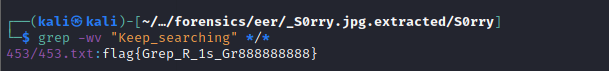
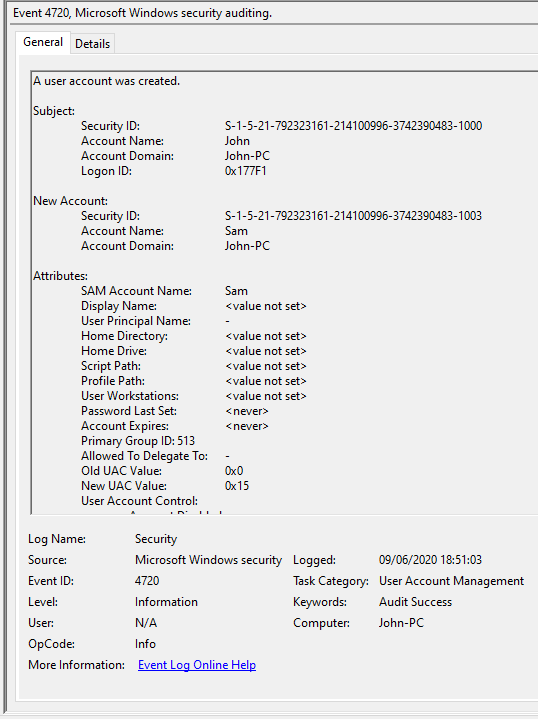

# CyberTalents Scholarship - Digital Forensics CTF

## 1. Main File
Category: General Information <br>
Level: Basic <br>
Points: 25 <br>

##### Challenge Description: 
Considered one of the most important files in the NTFS file system. It keeps records of all files in a volume, the files' location in the directory, the physical location of the files on the drive, and file metadata. <br>

Flag: MFT


## 2. S0rry
Category: Digital Forensics <br>
Level: easy <br>
Points: 50 <br>

##### Challenge Description: 
Every great tomb has a lot of decoys and we think this mummy has a lot inside it but first can you make the way clearer?

Challenge Link: 

##### Solution:
On attempting to extract the files, we are prompted for a password which we don't know. <br>

 <br>

Create a hash file for the zip file using zip2john. we are going to use that to crack the password for the zip file.

 <br>
Then crack it. <br>
 <br>

After getting the password, we extract the PNG file. We see nothing of interest on it on a quick glance.
The strings command, however, reveals that it contains embedded .txt files. <br>
Extract the files from the image using foremost or binwalk.

```bash
foremost S0rry.jpg
binwalk -e S0rry.jpg
```

err, that's like 1000 text files to read from, and we have to "Keep searching". grep, wya?
 <br>
 <br>

Flag: flag{Grep_R_1s_Gr888888888}


## 3. Jam
Category: Digital Forensics <br>
Level: easy <br>
Points: 50 <br>

##### Challenge Description: 
n0 replay without jam

##### Challenge Link: 


##### Solution: 

How to solve it programatically by 0xMohammed: [link](https://github.com/0xMohammed/MISC/tree/main/Cybertalents/DFIR-scholarship-CTF/jam) <br>

The manual way: <br>
On playing the audio file, you will realise that there is some sound somewhat at the middle of the file.
- On audacity, ensure that it is in waveform mode. there will be a marker where there was some audible sound output. it will be at around the 7.8 mark
- zoom in on the area to reveal the waveform. Simple observation will have you will realise that the first part of the wave represents (or rather is equal) to the smallest part of the wave. This will represent a bit
- We are going to convert the highs and lows to 1s and 0s in order to get the flag.
- Press ctrl + 1 and ctrl + 3 to get the correct position where a bit represenation would match the time bar on top.
- Select the very beginning, press Shift + Home to select everything to the left of the beginning of the waveform and cut it or delete it. On notting down the values, keep on deleting the read part of the waveform until the end, all the while while taking note of the markers position. (this ensures you don't mess up by accidentally skipping or repeating some values)

 <br>

at the end you will get the following binary number:
01000110 01101100 01100001 01100111 01111011 01110011 01110100 00110011 01110000 01011111 00110001 01011111 01110100 00110000 01011111 01101000 01100001 01100011 01001011 01011111 01101101 01111001 01011111 01100011 01100001 01110010 01011111 01110011 01101111 01011111 01100110 01100001 01110010 01111101

convert to ascii:

Flag: Flag{st3p_1_t0_hacK_my_car_so_far}


## 4. new account

Category: Digital Forensics <br>
Level: easy <br>
Points: 50 <br>

#### Challenge Description: 
An attacker after compromising the machine added a new account as admin. can you find the name of the new account? 

flag format: flag{md5 of string}

##### Challenge link:


##### Solution:
Open the evtx file. <br>
Googling tells us that event id 4720 is related to user account creation. <br>
Sorting by event IDs leads us to find the new account: Sam <br>

 <br>
Ref: https://docs.microsoft.com/en-us/windows/security/threat-protection/auditing/event-4720 <br>

 <br>

flag: flag{ba0e0cde1bf72c28d435c89a66afc61a}


## 5. Little Story Boy

Category: Digital Forensics <br>
Level: easy <br>
Points: 50 <br>

##### Challenge Description: 
The Little Boy has wonderful Story. Can You Help us to know it?

##### Challenge Link:


##### Solution:
PNG image steganography. <br>
We use zsteg tool <br>


Flag: FLAG{LSB_!$_SuP3r_DuP3r_E@syy_!_}


## 6. Runecover

Category: Digital Forensics <br>
Level: medium <br>
Points: 100 <br>

##### Challenge Description:
We are exchanging secrets.

##### Challenge Link:


##### Solution:
The .pcap file doesn't open with Wireshark. We'll have to extract the contents to observe it. <br>
 <br>

 <br>


## 7. Attacker cmd History

Category: Digital Forensics <br>
Level: medium <br>
Points: 100 <br>

##### Challenge Description:
After acquiring memory from attacker pc we need to what bad things happend 

##### Challenge Link:


##### Solution: 

Volatility2 will be faster for this challenge. <br> 
 <br> <br>
From the help menu, we see that the three commands that can be used to interact with the cmd history.
consoles will be of interest in this case

```bash
vol2 -f "cmd history.mem" --profile=Win7SP1x86 consoles
```
Notice the output that captures our interest. Decode the base64 string to get the flag <br>


Flag: flag{consoles_For_Input_And_Output}


## 8. Malicious File

Category: Digital Forensics <br>
Level: medium <br>
Points: 100 <br>

##### Challenge Description:
While investigating a compromised machine the examiner found a suspicious file executed. the file belongs to windows crack he needs to find the MFT entry number for the directory where the file executed. 

flag format: md5 of string 

##### Challenge Link:
[!UserClass.dat](../uploads/CT-DF-S/UsrClass.dat)

##### Solution:
 <br>

This is a windows registry file. We'll use  for this challenge to load the local hive file

Windows Loader by DAZ looks like an obvious culprit. Click on the subfolders. <br>
Looking on the details pane, we can find an MFT entry of 17120 <br>


Flag: d72eecc6b164864790fe25f2bd64a8ab